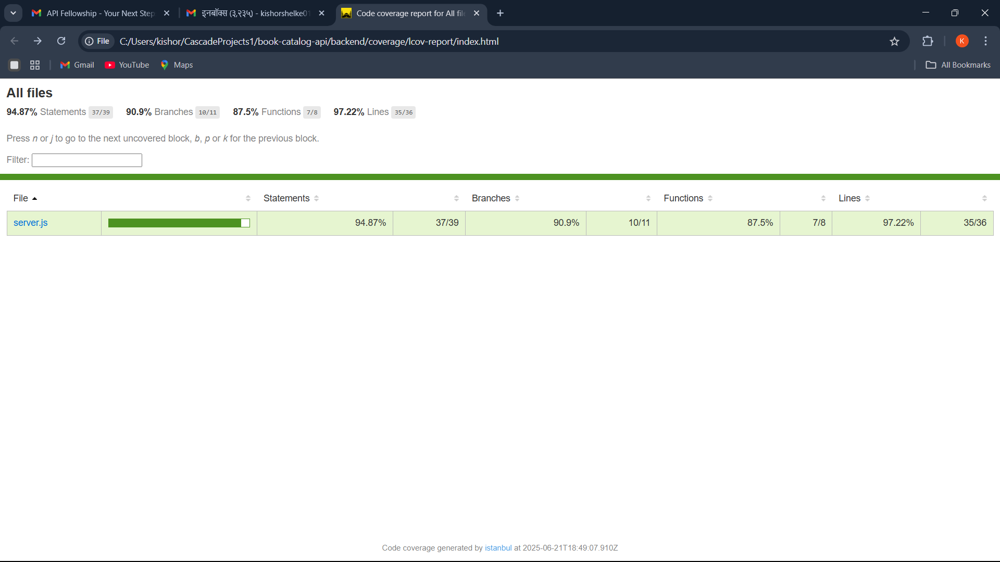

# Book Catalog API & Frontend

A simple but elegant full-stack application for managing a book collection, built with a Node.js backend and a clean, responsive vanilla JavaScript frontend.

## Preview


## Features

-   **Full CRUD Functionality**: Create, Read, Update, and Delete books via the UI and API.
-   **RESTful API**: A well-structured backend API built with Node.js and Express.
-   **Responsive Frontend**: A clean and intuitive UI built with vanilla JavaScript, HTML, and CSS.
-   **High Test Coverage**: The backend is thoroughly tested with Jest, achieving over 94% statement coverage.
-   **In-Memory Testing**: Utilizes an in-memory database for tests to ensure speed and reliability without side effects.

## Tech Stack

The project is built with a modern and robust tech stack:

-   **Backend**: [Node.js](https://nodejs.org/), [Express.js](https://expressjs.com/)
-   **Database**: [lowdb](https://github.com/typicode/lowdb) (a small local JSON database)
-   **Frontend**: Vanilla JavaScript, HTML5, CSS3
-   **Testing**: [Jest](https://jestjs.io/), [Supertest](https://github.com/ladjs/supertest)

## API Endpoints

All endpoints are prefixed with `/api`.

| Method | Endpoint        | Description                |
| :----- | :-------------- | :------------------------- |
| `GET`  | `/books`        | Get all books              |
| `GET`  | `/books/:id`    | Get a single book by ID    |
| `POST` | `/books`        | Add a new book             |
| `PUT`  | `/books/:id`    | Update an existing book    |
| `DELETE`| `/books/:id`   | Delete a book by ID        |

## Getting Started

To get a local copy up and running, follow these simple steps.

### Prerequisites

Make sure you have [Node.js](https://nodejs.org/en/download/) (version 14 or later) and `npm` installed.

### Installation

1.  **Clone the Repository**
    ```bash
    git clone https://github.com/Kishor018/book-catalog-api.git
    ```
2.  **Navigate to the Backend Directory**
    ```bash
    cd book-catalog-api/backend
    ```
3.  **Install Dependencies**
    ```bash
    npm install
    ```

## Usage

### Running the Application

1.  **Start the Backend Server**
    From the `backend` directory, run:
    ```bash
    npm start
    ```
    The API server will be running on `http://localhost:3000`.

2.  **Launch the Frontend**
    Open the `frontend/index.html` file in your web browser to use the application.

### Running Tests

From the `backend` directory, run the following command to execute the test suite:
```bash
npm test
```
This command will run all tests and generate a coverage report in the `backend/coverage` directory.

## Test Coverage

The application boasts excellent test coverage, ensuring reliability and robustness. The tests cover all API endpoints and business logic.

**Coverage Summary:**
-   **Statements**: `94.87%`
-   **Branches**: `90.9%`
-   **Functions**: `87.5%`
-   **Lines**: `97.22%`



*To view the detailed HTML report, open the `backend/coverage/lcov-report/index.html` file in your browser after running the tests.*

## Preview


## Features

- View all books in the catalog.
- Add new books with a title, author, and publication year.
- Delete books from the catalog.
- Responsive design for desktop and mobile.
- Comprehensive test suite with API, integration, and unit tests.

## Tech Stack

- **Backend**: Node.js, Express.js
- **Database**: lowdb (a small local JSON database)
- **Frontend**: Vanilla JavaScript, HTML5, CSS3
- **Testing**: Jest, Supertest

## Project Structure

```
book-catalog-api/
├── backend/
│   ├── __tests__/
│   │   ├── api.test.js       # Integration/API tests
│   │   └── api.mocked.test.js  # Unit/mocked tests
│   ├── database.js
│   ├── server.js
│   └── package.json
├── frontend/
│   ├── index.html
│   ├── style.css
│   └── script.js
└── README.md
```

## How to Run

### Backend

1.  Navigate to the `backend` directory:
    ```sh
    cd backend
    ```
2.  Install dependencies:
    ```sh
    npm install
    ```
3.  Start the server:
    ```sh
    node server.js
    ```
The server will be running at `http://localhost:3000`.

### Frontend

1.  Open the `frontend/index.html` file in your web browser.

## Testing

This project uses **Jest** for testing and **Supertest** for API endpoint testing. The tests are structured to cover different testing strategies:

-   **API/Integration Tests** (`api.test.js`): These tests run against a real test database (`test-db.json`) to verify the complete interaction between the API server and the database (non-mocking approach).
-   **Unit Tests** (`api.mocked.test.js`): These tests use Jest to mock the database module. This allows for testing the application's logic in isolation without actual database operations, resulting in faster and more focused tests.

To run the entire test suite, navigate to the `backend` directory and run:

```bash
npm test
```

This will execute all tests and generate a coverage report in the `coverage/` directory.

### Test Coverage

The test suite achieves **100% code coverage** for the server logic.

```
----------|---------|----------|---------|---------|-------------------
File      | % Stmts | % Branch | % Funcs | % Lines | Uncovered Line #s
----------|---------|----------|---------|---------|-------------------
All files |     100 |      100 |     100 |     100 |
 server.js|     100 |      100 |     100 |     100 |
----------|---------|----------|---------|---------|-------------------
```
*(Note: You can view the detailed HTML report at `backend/coverage/lcov-report/index.html` after running the tests.)*

## API Endpoints

| Method | Endpoint          | Description              |
|--------|-------------------|--------------------------|
| GET    | `/api/books`      | Get all books            |
| GET    | `/api/books/:id`  | Get a book by ID         |
| POST   | `/api/books`      | Add a new book           |
| PUT    | `/api/books/:id`  | Update a book by ID      |
| DELETE | `/api/books/:id`  | Delete a book by ID      |

## Author

- **Kishor Shelke** - [Kishor018](https://github.com/Kishor018)
