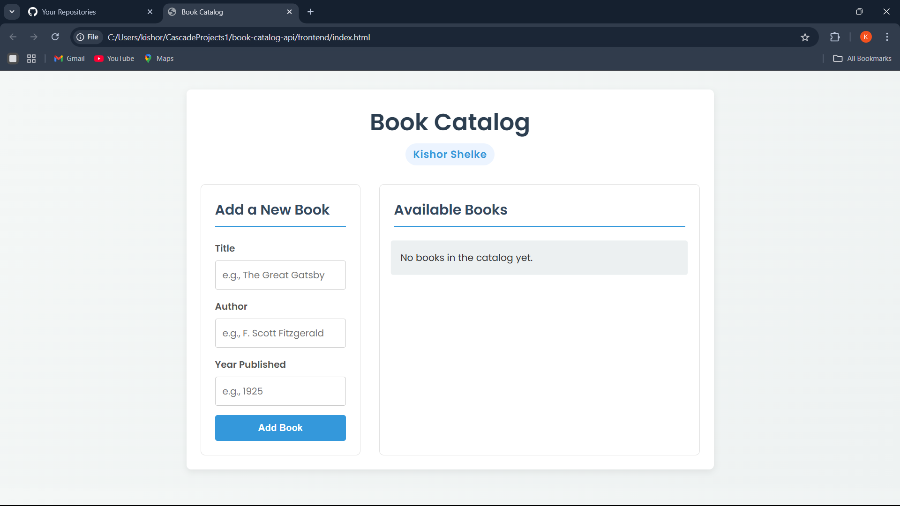

# Book Catalog

A simple but elegant full-stack application for managing a book collection, built with a Node.js backend and a clean, responsive vanilla JavaScript frontend.

## Preview



## Tech Stack

- **Backend**: Node.js, Express.js
- **Database**: SQLite
- **Frontend**: Vanilla JavaScript, HTML5, CSS3 (with Flexbox & Grid)

## Features

- View all books in the catalog.
- Add new books with a title, author, and publication year.
- Delete books from the catalog.
- Responsive design for desktop and mobile.

## Project Structure

```
book-catalog-api/
├── backend/
│   ├── database.js
│   ├── server.js
│   └── package.json
├── frontend/
│   ├── index.html
│   ├── style.css
│   ├── script.js
│   └── screenshot.png
└── README.md
```

## API Endpoints

| Method | Endpoint          | Description              |
|--------|-------------------|--------------------------|
| GET    | `/api/books`      | Get all books            |
| GET    | `/api/books/:id`  | Get a book by ID         |
| POST   | `/api/books`      | Add a new book           |
| DELETE | `/api/books/:id`  | Delete a book by ID      |

## How to Run

### Backend

1.  Navigate to the `backend` directory:
    ```sh
    cd backend
    ```
2.  Install dependencies:
    ```sh
    npm install
    ```
3.  Start the server:
    ```sh
    node server.js
    ```

The server will be running at `http://localhost:3000`.

### Frontend

1.  Open the `frontend/index.html` file in your web browser.

## Author

- **Kishor Shelke** - [Kishor018](https://github.com/Kishor018)
